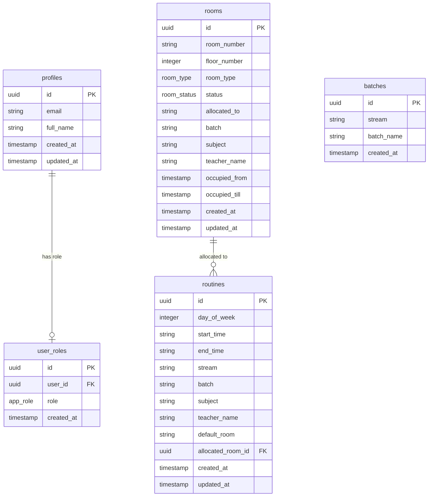

# 🏫 TIU Room Buddy (SmartRoom Finder)

> A premium, real-time room availability tracking and schedule management system for **Techno India University (TIU)**. Built to optimize campus space utilization for students and administrators alike.

---

## 📖 Project Overview

**TIU Room Buddy** (also known as SmartRoom Finder) is a modern web application designed to solve the daily challenge of finding and allocating classrooms, labs, and conference rooms. With dynamic floor grids, routine visualization matrices, conflict checks, and role-based permissions, the application streamlines classroom management.

* **For Students**: Real-time visualization of classroom status (Free vs. Occupied), subject details, and the daily room schedules.
* **For Administrators**: A full control center to allocate rooms, view room schedules, resolve conflicts, manage streams/batches, and bulk upload routine schedules.

---

## ✨ Features

### 📅 Allocation & Schedule Management
* **Real-Time Floor Grids**: Color-coded, interactive maps representing floors (Ground Floor up to 6th Floor). Instant status updates (🟢 Green for Free, 🔴 Red for Occupied).
* **Interactive Timelines**: Clicking on any room reveals a comprehensive day timeline with hourly availability and booking information.
* **Weekly Schedule Matrix**: A master grid of `Rooms × Time Slots` displaying current bookings. Clicking on empty slots allows quick allocation, while occupied slots support inspection and deallocation.
* **Quick Allocation with Conflict Resolution**: 
  - Prevents double-booking teachers across different rooms for the same time slot.
  - Detects if a specific batch/section is already scheduled elsewhere.
  - Prompts warnings but allows override options if necessary.

### ⚙️ Administration & Data Integration
* **Bulk CSV Routine Upload**:
  - Drag-and-drop interface supporting multi-file uploads.
  - Live data parsing and structure validation via PapaParse.
  - Interactive table displaying uploaded records with error highlights (e.g., incorrect time formats, invalid days).
  - Downloadable CSV template configured specifically for stream batches.
* **Batch & Stream Management**:
  - Dynamic grouping of streams (e.g., B.Tech, B.Sc, BBA).
  - Management of batches and sections with inline creation and deletion options.

### 🛡️ Core Infrastructure & UX
* **Role-Based Auth Control**: Custom user roles (Admin, Teacher, Student) that redirect users to their respective workspace dashboard.
* **Modern Design & Dark Mode**:
  - Premium theme toggles supporting Light, Dark, and System-default views.
  - Clean layout powered by Tailwind CSS and Shadcn UI.
  - Helpful toast notifications (Sonner/Toaster) for successful operations and system warnings.

---

## 🛠️ Technology Stack

| Layer | Technology | Purpose |
| :--- | :--- | :--- |
| **Frontend Core** | React 18, TypeScript, Vite | Fast, type-safe development environment and component structures. |
| **UI & Styling** | Tailwind CSS, Shadcn UI, Lucide Icons | Responsive layouts, accessible UI components, and premium micro-interactions. |
| **Database & Auth** | Supabase | PostgreSQL Database, User Authentication, and Role Policies. |
| **Data Fetching** | TanStack React Query (v5) | Efficient server-state synchronization and cache management. |
| **Forms & Validation** | React Hook Form, Zod | Type-safe form validation and routine constraint checks. |
| **CSV Engine** | PapaParse | Client-side CSV parsing for bulk imports. |

---

## 🗄️ Database Schema

The backend architecture consists of five primary relational tables in Supabase:



### Table Definitions & Enums
1. **`profiles`**: User profiles mapped to Supabase Authentication users.
2. **`user_roles`**: Links users to specific application roles: `'admin' | 'student' | 'teacher'`.
3. **`rooms`**: Storage for room entities, floor designations, types (`'classroom' | 'lab' | 'conference'`), and occupancy flags.
4. **`batches`**: Reference table for academic batches grouped by program streams.
5. **`routines`**: The core schedule table. Stores default rooms, allocated room IDs, subjects, instructors, time slots, and weekday indexes (`1` = Monday, `6` = Saturday).

---

## 🚀 Getting Started & Local Setup

### Prerequisites
* Ensure you have [Node.js](https://nodejs.org/) installed (v18+ recommended).
* A Supabase project initialized with the corresponding schema migrations.

### Step 1: Clone and Enter the Directory
```sh
git clone <your-repository-url>
cd tiu-room-buddy
```

### Step 2: Install Dependencies
```sh
npm install
```

### Step 3: Configure Environment Variables
Create a `.env` file in the root of the `tiu-room-buddy` directory and insert your Supabase credentials:
```env
VITE_SUPABASE_URL="https://your-project-id.supabase.co"
VITE_SUPABASE_ANON_KEY="your-anon-key-here"
```

### Step 4: Run the Application Locally
Launch the Vite development server:
```sh
npm run dev
```
Open your browser and navigate to `http://localhost:5173`.

---

## 📦 Build & Production

To compile a production bundle with optimized asset loading:

```sh
npm run build
```

This will run TypeScript type checking and output a production-ready build to the `/dist` directory. You can preview the production bundle locally using:

```sh
npm run preview
```

---

## 🔒 Security & Row Level Security (RLS)

* All database tables have **Row Level Security (RLS)** active.
* **Students/Teachers** are restricted to read-only access (`SELECT`) to rooms, routines, and batches.
* **Administrators** possess full write privileges (`INSERT`, `UPDATE`, `DELETE`) secured using database checks mapping user IDs to the `admin` role in `user_roles`.
